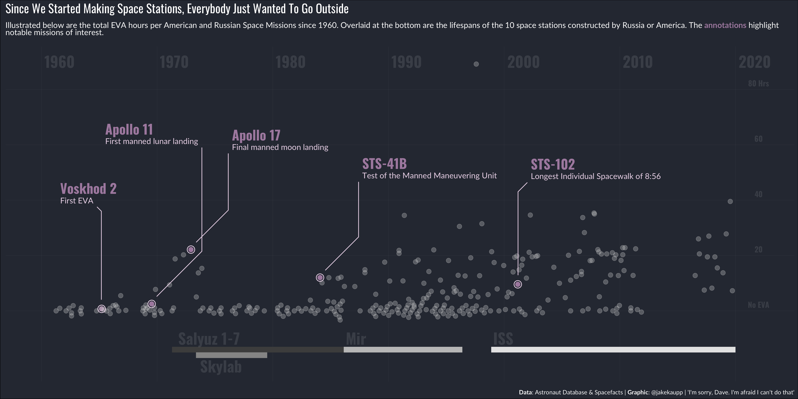
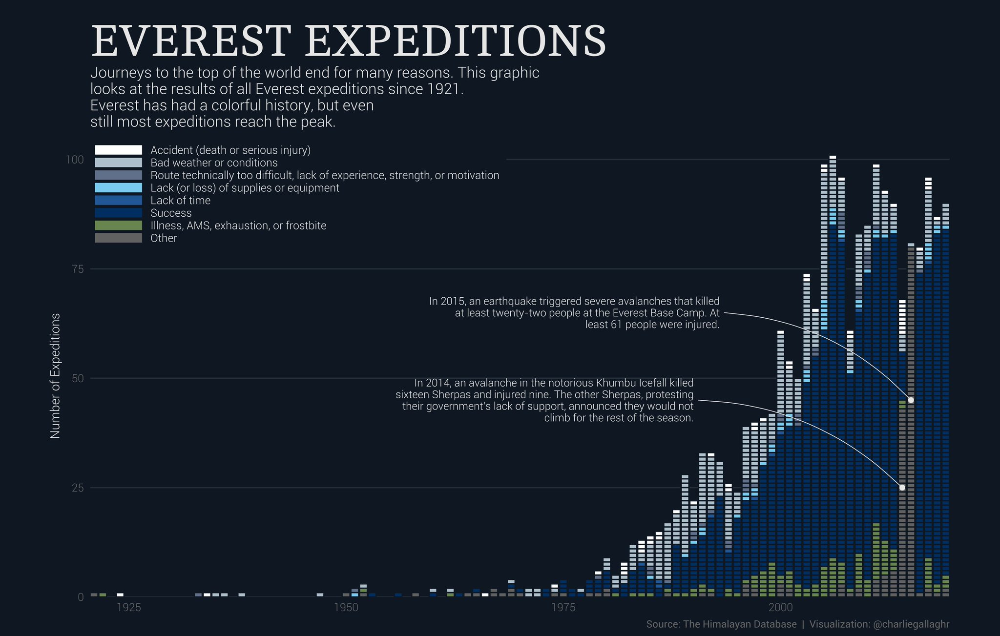

```{r render, eval=F, echo=F}
library(rmarkdown)
library(xaringan)
library(GGally)
library(ggforce)
render("how-to-wow.rmd")
```

```{r knitr, include=FALSE, cache=FALSE}
library(knitr)
knitr::opts_chunk$set(
  fig.align = "center",
  fig.dpi = 320,
  fig.height = 5,
  fig.width = 5,
  dev="svg",
  message = FALSE,
  warning = FALSE,
  collapse = TRUE,
  ##cache = TRUE, cache.lazy = FALSE,
  comment = "#>")
options(htmltools.dir.version = FALSE)
```

class: title-slide, center, middle, inverse

# `r rmarkdown::metadata$title`
## *`r rmarkdown::metadata$subtitle`*

### by `r rmarkdown::metadata$author`

---

# Topics

- Create __beautiful plots__ with `ggplot2`

--

- __Literate programming__ with `Rmarkdown`

--

- Build __interactive apps__ with `shiny`

--

- __Share your work__ as a package

---

class: inverse, middle, center

# Pretty plots: <br> Intro to `ggplot2`

---

# ggplot2

A package to create __highly customisable publication-ready plots__

--

Key elements:

* .bold[aesthetic]: what you want to graph (e.g. x, y, colours, etc)

* .bold[geom]: how you want to graph it (e.g. scatterplot, histogram)

* .bold[options]: optional titles, themes, etc.

---

# Installing and loading ggplot2

To install ggplot2:
```r
install.packages("ggplot2")
```

Once installed, load as follows:
```{r}
library("ggplot2")
```

---

## The `bmi2` dataset
The dataset used for the following graphics contains 200 observations across the following six variables:

|id|age|bmi|sex|diet|status|
|----|
|1|78.2|29.3|Male  |Good|Unhealthy|
|2|48.5|33.0|Female|Good|Unhealthy|
|3|79.5|31.5|Female|Good|Unhealthy|
|4|78.5|28.1|Male  |Poor|Healthy|

Load a copy of the dataset to follow along:

```r
df <- read.csv("https://tinyurl.com/bmi2dat")
## https://perishky.github.io/r/how-to-wow/bmi2.csv
```


---
class: split-40
count: false

.pull-left[.content[

```r
*ggplot(data = df)
```
]]
.pull-right[.content.center[

]]
---
class: split-40
count: false

.pull-left[.content[

```r
ggplot(data = df) +
*aes(x = age)
```
]]
.pull-right[.content.center[

]]
---
class: split-40
count: false

.pull-left[.content[

```r
ggplot(data = df) +
aes(x = age) +
*aes(y = bmi)
```
]]
.pull-right[.content.center[

]]
---
class: split-40
count: false

.pull-left[.content[

```r
ggplot(data = df) +
aes(x = age) +
aes(y = bmi) +
*geom_point()
```
]]
.pull-right[.content.center[

]]
---
class: split-40
count: false

.pull-left[.content[

```r
ggplot(data = df) +
aes(x = age) +
aes(y = bmi) +
geom_point() +
*aes(colour = sex)
```
]]
.pull-right[.content.center[

]]
---
class: split-40
count: false

.pull-left[.content[

```r
ggplot(data = df) +
aes(x = age) +
aes(y = bmi) +
geom_point() +
aes(colour = sex) +
*geom_smooth(
* method = "lm", 
* se = F)
```
]]
.pull-right[.content.center[

]]
---
class: split-40
count: false

.pull-left[.content[

```r
ggplot(data = df) +
aes(x = age) +
aes(y = bmi) +
geom_point() +
aes(colour = sex) +
geom_smooth(
  method = "lm", 
  se = F) +
*scale_color_manual(
* values = c("blue","purple"))
```
]]
.pull-right[.content.center[

]]
---
class: split-40
count: false

.pull-left[.content[

```r
ggplot(data = df) +
aes(x = age) +
aes(y = bmi) +
geom_point() +
aes(colour = sex) +
geom_smooth(
  method = "lm", 
  se = F) +
scale_color_manual(
  values = c("blue","purple")) +
*ylim(c(15, 35))
```
]]
.pull-right[.content.center[

]]
---
class: split-40
count: false

.pull-left[.content[

```r
ggplot(data = df) +
aes(x = age) +
aes(y = bmi) +
geom_point() +
aes(colour = sex) +
geom_smooth(
  method = "lm", 
  se = F) +
scale_color_manual(
  values = c("blue","purple")) +
ylim(c(15, 35)) +
*labs(
* x = "Age",
* y = "Body Mass Index (BMI)",
* colour = "")
```
]]
.pull-right[.content.center[

]]
---
class: split-40
count: false

.pull-left[.content[

```r
ggplot(data = df) +
aes(x = age) +
aes(y = bmi) +
geom_point() +
aes(colour = sex) +
geom_smooth(
  method = "lm", 
  se = F) +
scale_color_manual(
  values = c("blue","purple")) +
ylim(c(15, 35)) +
labs(
  x = "Age",
  y = "Body Mass Index (BMI)",
  colour = "") +
*labs(title = "BMI by Age")
```
]]
.pull-right[.content.center[

]]
---
class: split-40
count: false

.pull-left[.content[

```r
ggplot(data = df) +
aes(x = age) +
aes(y = bmi) +
geom_point() +
aes(colour = sex) +
geom_smooth(
  method = "lm", 
  se = F) +
scale_color_manual(
  values = c("blue", "purple")) +
ylim(c(15, 35)) +
labs(
  x = "Age",
  y = "Body Mass Index (BMI)",
  colour = "") +
labs(title = "BMI by Age") +
*labs(subtitle = "Colour indicates sex")
```
]]
.pull-right[.content.center[

]]

---


class: split-40
count: false

.pull-left[.content[

```r
*ggplot(data = df)
```
]]
.pull-right[.content.center[

]]
---
class: split-40
count: false

.pull-left[.content[

```r
ggplot(data = df) +
*aes(x = age)
```
]]
.pull-right[.content.center[

]]
---
class: split-40
count: false

.pull-left[.content[

```r
ggplot(data = df) +
aes(x = age) +
*aes(y = bmi)
```
]]
.pull-right[.content.center[

]]
---
class: split-40
count: false

.pull-left[.content[

```r
ggplot(data = df) +
aes(x = age) +
aes(y = bmi) +
*geom_point()
```
]]
.pull-right[.content.center[

]]
---
class: split-40
count: false

.pull-left[.content[

```r
ggplot(data = df) +
aes(x = age) +
aes(y = bmi) +
geom_point() +
*geom_smooth(
* method = "lm", 
* se = F)
```
]]
.pull-right[.content.center[

]]
---
class: split-40
count: false

.pull-left[.content[

```r
ggplot(data = df) +
aes(x = age) +
aes(y = bmi) +
geom_point() +
geom_smooth(
  method = "lm", 
  se = F) +
*theme_bw()
```
]]
.pull-right[.content.center[

]]
---
class: split-40
count: false

.pull-left[.content[

```r
ggplot(data = df) +
aes(x = age) +
aes(y = bmi) +
geom_point() +
geom_smooth(
  method = "lm", 
  se = F) +
theme_bw() +
*theme_void()
```
]]
.pull-right[.content.center[

]]
---
class: split-40
count: false

.pull-left[.content[

```r
ggplot(data = df) +
aes(x = age) +
aes(y = bmi) +
geom_point() +
geom_smooth(
  method = "lm", 
  se = F) +
theme_bw() +
theme_void() +
*theme_classic()
```
]]
.pull-right[.content.center[

]]
---
class: split-40
count: false

.pull-left[.content[

```r
ggplot(data = df) +
aes(x = age) +
aes(y = bmi) +
geom_point() +
geom_smooth(
  method = "lm", 
  se = F) +
theme_bw() +
theme_void() +
theme_classic() +
*ggthemes::theme_economist()
```
]]
.pull-right[.content.center[

]]
---
class: split-40
count: false

.pull-left[.content[

```r
ggplot(data = df) +
aes(x = age) +
aes(y = bmi) +
geom_point() +
geom_smooth(
  method = "lm", 
  se = F) +
theme_bw() +
theme_void() +
theme_classic() +
ggthemes::theme_economist() +
*ggthemes::theme_stata()
```
]]
.pull-right[.content.center[

]]


---

class: split-40
count: false

.pull-left[.content[

```r
*ggplot(data = df)
```
]]
.pull-right[.content.center[

]]
---
class: split-40
count: false

.pull-left[.content[

```r
ggplot(data = df) +
*aes(x = status)
```
]]
.pull-right[.content.center[

]]
---
class: split-40
count: false

.pull-left[.content[

```r
ggplot(data = df) +
aes(x = status) +
*geom_histogram(stat = "count")
```
]]
.pull-right[.content.center[

]]
---
class: split-40
count: false

.pull-left[.content[

```r
ggplot(data = df) +
aes(x = status) +
geom_histogram(stat = "count") +
*aes(fill = diet)
```
]]
.pull-right[.content.center[

]]
---
class: split-40
count: false

.pull-left[.content[

```r
ggplot(data = df) +
aes(x = status) +
geom_histogram(stat = "count") +
aes(fill = diet) +
*labs(fill = "Diet status")
```
]]
.pull-right[.content.center[

]]
---
class: split-40
count: false

.pull-left[.content[

```r
ggplot(data = df) +
aes(x = status) +
geom_histogram(stat = "count") +
aes(fill = diet) +
labs(fill = "Diet status") +
*labs(
* title = "Number of people by status",
* subtitle = "Colour indicates diet",
* x = "Status",
* y = "Number of people")
```
]]
.pull-right[.content.center[

]]
---
class: split-40
count: false

.pull-left[.content[

```r
ggplot(data = df) +
aes(x = status) +
geom_histogram(stat = "count") +
aes(fill = diet) +
labs(fill = "Diet status") +
labs(
  title = "Number of people by status",
  subtitle = "Colour indicates diet", 
  x = "Status", 
  y = "Number of people") +
*theme(
* axis.title=element_text(colour="red"))
```
]]
.pull-right[.content.center[

]]
---
class: split-40
count: false

.pull-left[.content[

```r
ggplot(data = df) +
aes(x = status) +
geom_histogram(stat = "count") +
aes(fill = diet) +
labs(fill = "Diet status") +
labs(
  title = "Number of people by status",
  subtitle = "Colour indicates diet", 
  x = "Status", 
  y = "Number of people") +
theme(
  axis.title=element_text(colour="red"))+
*theme(legend.position = "bottom")
```
]]
.pull-right[.content.center[

]]
---
class: split-40
count: false

.pull-left[.content[

```r
ggplot(data = df) +
aes(x = status) +
geom_histogram(stat = "count") +
aes(fill = diet) +
labs(fill = "Diet status") +
labs(
  title = "Number of people by status",
  subtitle = "Colour indicates diet", 
  x = "Status", 
  y = "Number of people") +
theme(
  axis.title=element_text(colour="red"))+
theme(legend.position = "bottom") +
*theme(panel.grid = element_blank())
```
]]
.pull-right[.content.center[

]]
---
class: split-40
count: false

.pull-left[.content[

```r
ggplot(data = df) +
aes(x = status) +
geom_histogram(stat = "count") +
aes(fill = diet) +
labs(fill = "Diet status") +
labs(
  title = "Number of people by status",
  subtitle = "Colour indicates diet", 
  x = "Status", 
  y = "Number of people") +
theme(
  axis.title=element_text(colour="red"))+
theme(legend.position = "bottom") +
theme(panel.grid = element_blank()) +
*theme(
* panel.background=element_rect(fill="black"))
```
]]
.pull-right[.content.center[

]]
---
class: split-40
count: false

.pull-left[.content[

```r
ggplot(data = df) +
aes(x = status) +
geom_histogram(stat = "count") +
aes(fill = diet) +
labs(fill = "Diet status") +
labs(
  title = "Number of people by status",
  subtitle = "Colour indicates diet", 
  x = "Status", 
  y = "Number of people") +
theme(
  axis.title=element_text(colour="red"))+
theme(legend.position = "bottom") +
theme(panel.grid = element_blank()) +
theme(
  panel.background=element_rect(fill="black")) +
*theme(title = element_text(size = 20))
```
]]
.pull-right[.content.center[

]]

---

# Virtually endless customisability

Plots on previous slides are __only a taster__

Can make __any plot you can think up__

__Key resources__, all open-source:

* [`ggplot2` documentionation and cheatsheet](https://ggplot2.tidyverse.org/) - great starting point.

* ["Data visualisation"](https://socviz.co/) by Kieran Healy - great introductory text on the science of data visualization, with examples in R.

* [Tidy Tuesday](https://github.com/rfordatascience/tidytuesday) - weekly community-run visualization exercise

---

.center[
   
]

---

.center[

   
]

---

.center[
   
]

---

# Recap

Key concept is that you are __adding elements together__:

- first the data 

- then the elements of the data you want to display (`aesthetics`)

- then the way you want to display them (`geoms`)

- then extra options (colour/themes/titles)

---

class: inverse, middle, center

# Literate programming: <br> `RMarkdown`

---

# `RMarkdown`

.Large[

A single file (with `.Rmd` extension) that incorporates text, code and output (results and figures)

Can be converted to multiple formats:

* HTML (web-page)

* Word

* PDF

]

---

# Components of a `RMarkdown` file

.Large[

**A (optional) YAML header surrounded by three hyphens (---)**

* Defines metadata, such as the title, author and date
* Defines the output format (Word, PDF, HTML, etc.)

**Code chunks: R code chunks surrounded by backticks (`) **

* This is where the core computation happens
* Can choose to show the underlying code or just the results

** Text with inline code** 

* Great for presenting results as part of a sentence
* E.g. The mean of the age variable was `` `r
mean(age)` ``


]

---

# RMarkdown example

https://github.com/MRCIEU/introduction-to-r/tree/main/how-to-wow/rmd-example

---

# Why bother?


Improves __reproducibility__ and __transparency__, as the origin of every single result in the paper can be examined

--

Makes a lot of tasks more __straightforward__:

* Updating a manuscript with new __data/analyses__

* __Citing__ other work 

* Controlling __figure placement__

---

# Things you can produce using `RMarkdown`

* Academic papers ([example](https://github.com/mcguinlu/data-availability-impact))

* Theses ([bristolthesis](https://github.com/mattlee821/bristolthesis))

* Supervisory reports (great if format is similar each time)

* Slides (this slide deck was made using `RMarkdown`!)

---

# Resources

[RMarkdown tutorial](https://rmarkdown.rstudio.com/lesson-1.html) from RStudio

[RMarkdown: The Definitive Guide](https://bookdown.org/yihui/rmarkdown/) by 
Yihui Xie 

---

class: inverse, middle, center

# Making R accessible: <br> Intro to `shiny`

---

# What is .cb[`shiny`]?
.cb[`shiny`] is an R package that allows users to __build interactive web applications__ ("apps") straight from R.

.pull-left[
`Shiny` apps are web-pages that users can interact with to: 

* Explore data

* Perform analyses

* Create plots
]

.pull-right[
<br>
.center[

]
]

---

# Example

http://epidelta.mrcieu.ac.uk/

Source code: https://github.com/perishky/epidelta/blob/master/app/app.R


---


# Structure of a .cb[`shiny`] app


A .cb[`shiny`] app is a special type of `R` file that has three components:

* User interface

* Server

* Call to the .cb[`shinyApp`]

---

# How it works

Essentially using a __webpage__ rather than __console__ to instruct R.

.center[

]

---

# Why bother?

* R has a __high barrier to entry__ for new users

* Apps allow those without any experience of R to __explore__ and __benefit__ from your work

* The more people who can use it, the __better known/cited__ it will be!


---

# Resources


[`shiny` gallery](https://shiny.rstudio.com/gallery/) - collection of example apps, with the underlying R code

[`shiny` cheatsheet](https://shiny.rstudio.com/images/shiny-cheatsheet.pdf) - 2-page summary of functions

[`shiny contest`](https://community.rstudio.com/tag/shiny-contest) - annual competition with prizes for the most impressive/most imaginative app

[Bristol short course on data visualisation and web applications](https://www.bristol.ac.uk/medical-school/study/short-courses/2021-22-courses/introduction-to-data-visualisation-and-web-applications-using-r/) has a half-day dedicated to building `shiny` apps


---

class: inverse, middle, center

# Packaging your code

---

# Why package?

<blockquote class="twitter-tweet"><p lang="en" dir="ltr">"I wish I'd left this code across scattered .R files instead of combining it into a package" said no one ever #rstats</p>-- David Robinson (@drob) June 19, 2015</blockquote> 

<br>

__Benefits:__

* __Reliable__ and __universal__ way to share code/data

* Makes it possible for others to __cite your work__

* Well-developed __testing framework__

---

# Example

https://github.com/MRCIEU/aries


---

# Where to get/share packages?

**CRAN**

* Official repository  
* Strict submission process to guarantee quality
* `install.packages("packagename")`

**Bioconductor**

* Topic specific repository, with a focus on bioinformatics  
* Strict submission requirements, similar to CRAN
* `BiocManager::install("packagename")`

**GitHub**

* Popular for open source projects  
* Wild west of packages
* `devtools::install_github("username/packagename")`

---

# Resources


[*R Packages* book](http://r-pkgs.had.co.nz/) by Hadley Wickham

[*Writing an R package from scratch*](hilaryparker.com/2014/04/29/writing-an-r-package-from-scratch/) by Hilary Parker


---

class: Large

# Wrapping up

Final points:

* Can do a __lot with R__, once you have a good grasp of the basics

--

* There is an __R package__ for pretty much everything you may want to do.

--

* Best way to learn is to __find a problem__ and try to __use R to solve it__.

---

## R Community 

* MRC IEU code-sharing channel on Slack

* `#rstats` hashtag on Twitter and "R" tagged posts on [stackoverflow](https://stackoverflow.com/questions/tagged/r)

.center[
   
]

.right[

Artwork by @allison_horst

]

---

## Slide credits

Luke McGuinness

* Email: [luke.mcguinness@bristol.ac.uk](mailto:luke.mcguinness@bristol.ac.uk)  
* Twitter: [@mcguinlu](https://twitter.com/mcguinlu)  
* GitHub: [@mcguinlu](https://github.com/mcguinlu)  

Original slides location:

[https://mcguinlu.github.io/slides/intro-to-r-phd/index.html](https://mcguinlu.github.io/slides/intro-to-r-phd/index.html#1)

